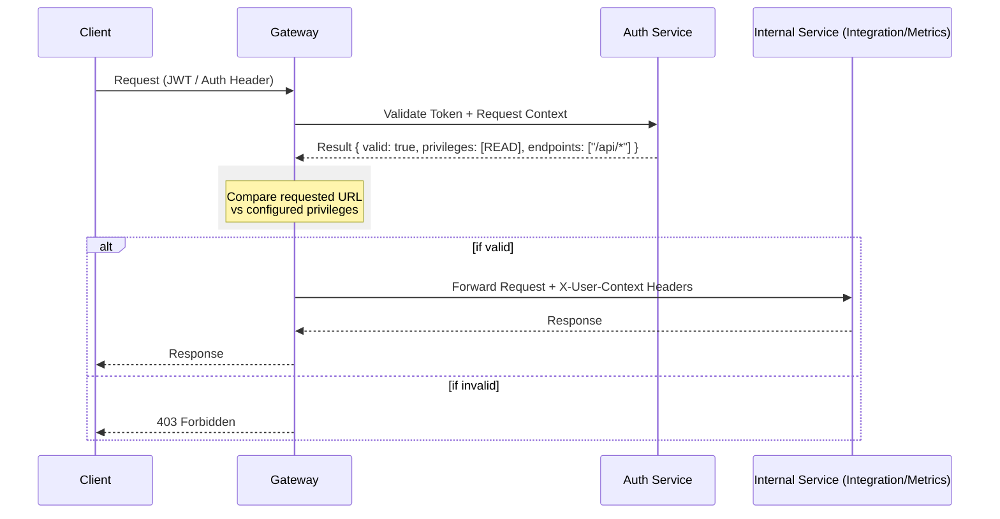

# Delegated Gateway Authorization Strategy

This approach centralizes all security logic into a dedicated **Auth Service**, with the **API Gateway** acting as the primary enforcement point (PEP).

## Flow Diagram

## 1. Key Components

### A. API Gateway Enforcement
The Gateway doesn't just check if the token is "good"; it checks if the token is good *for this specific path*.
- It receives the response from the Auth Service.
- It ensures the user's `privileges` allow the `action` (GET/POST) on the `resource`.

### B. The "Perimeter" Security Model
Internal services (like `integration-service`) do not implement Spring Security. They "trust" the Gateway.
- **Header Injection**: After validation, the Gateway injects user metadata (e.g., `X-Org-ID: acme-123`) into the request headers.
- **Internal Only**: These services should only be reachable from the Gateway's internal IP range (or within the same VPC/K8s namespace).

## 2. Special Case: External Webhooks
The `integration-service/webhook` controller cannot use the same "User Token" flow because GitHub/Jira don't have tokens from our Auth Service.

- **Gateway Configuration**: The Gateway must have an "Exclude List" for webhooks.
- **Signature Validation**: For `/github/webhook`, the internal service (or a Gateway plugin) should validate the `X-Hub-Signature-256` using a shared webhook secret, independent of the Auth Service.

## 3. Pros & Cons

| Pros | Cons |
| :--- | :--- |
| **Separation of Concerns**: Internal services stay "lean" and focus on business logic. | **Service Call Overhead**: Every request requires an extra internal call to the Auth Service. |
| **Centralized Logic**: Update authorization rules in one place without touching 10 services. | **Single Point of Failure**: If Auth Service goes down, the entire dashboard is unreachable. |
| **Audit Log**: Gateway can log every successful/failed auth attempt easily. | **Loose Internal Security**: A breach in one pod could allow lateral movement (since internal services are "naked"). |

## 4. Implementation Details (API Gateway Java)

- **Auth Filter**: Implement a custom `GatewayFilter` that makes an asynchronous call to the Auth Service.
- **Cache**: Implement a short-lived cache (e.g., Redis or Caffeine) in the Gateway for auth decisions to reduce latency from the Auth Service calls.
